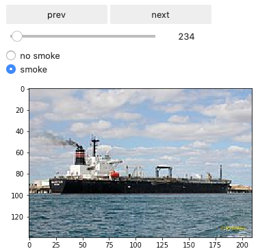

# Scrubber Watch


## Brief description


Links:
* pitch slides : 
    * TODO: add static demo and a little bit of description
* Paper: to come
* 1-Page summary 


## Scrubber Watch - Dashboard


## Analyzing Scrubber usage by detecting smoke on ships

* all relevant files are in subfolder `smoke_detection`

### Installation

1. Download the [dataset from kaggle](https://www.kaggle.com/arpitjain007/game-of-deep-learning-ship-datasets/) and unpack it into `smoke_detection`. 
You should now have the following folder structure:
    ```bash
    ---smoke_detection/train/images/*.png
    ```

2. unzip the additional smoke data `ship_smokes_fume_pollution.zip` and link it to the train folder
    ```bash
    cd smoke_detection
    unzip ship_smokes_fume_pollution.zip
    mv ship_smokes_fume_pollution train/images
    ```

2. copy `train_smoke.csv` to `train` folder
    ```bash
    cp train_smoke.csv train
    ```

3. train the recognition model
    ```bash
    python smoke_classification.py
    ```

4. run inference on input image
    ```bash
    python predict_smoke.py image.jpg
    ```

### Dataset

* We detect broken or missing scrubbers by looking at images of ships.
* This allows to track scrubber usage simply from a surveillance camera.
* To analyze the images, we rely on state-of-the-art computer vision. 
* However, smoke detection and quantification is a very niche topic, which is why there is no dataset readily available.
* To solve this problem, we created an annotation tool and manually annotated a publicly available dataset of ships.
* We annotated if smoke emission is clearly visible or not: `no smoke` vs `smoke`.
* The dataset we use is from the [game-of-deep-learning-ship-datasets](https://www.kaggle.com/arpitjain007/game-of-deep-learning-ship-datasets) kaggle challenge.
* This dataset comprises 6000 images of ships with their type annotations in 5 categories : Cargo, Military, Carrier, Cruise, Tankers. 
* We built a simple annotation tool that suits our problem. 
* Using our annotation tool, we annotated 2000 images from the kaggle challenge dataset and annotated if the smoke output is noticeable or not. 
* We additionally scraped images of ships with significant smoke output and added it to the dataset.


### Recognition model

* We train a simple object recognition model based on our manually annotated data.
* To do so, we use the [winning kernel](https://www.kaggle.com/sandeeppat/ship-classification-top-3-5-kernel) from the same kaggle challenge and adapt it to our data.


* TODO: results


### Ship Labelling Tool

* The ship labelling tool is a simple `jupyter notebook` with `ipywidgets`. It can be launched with
```bash
cd smoke_detection
jupyter-lab
```



