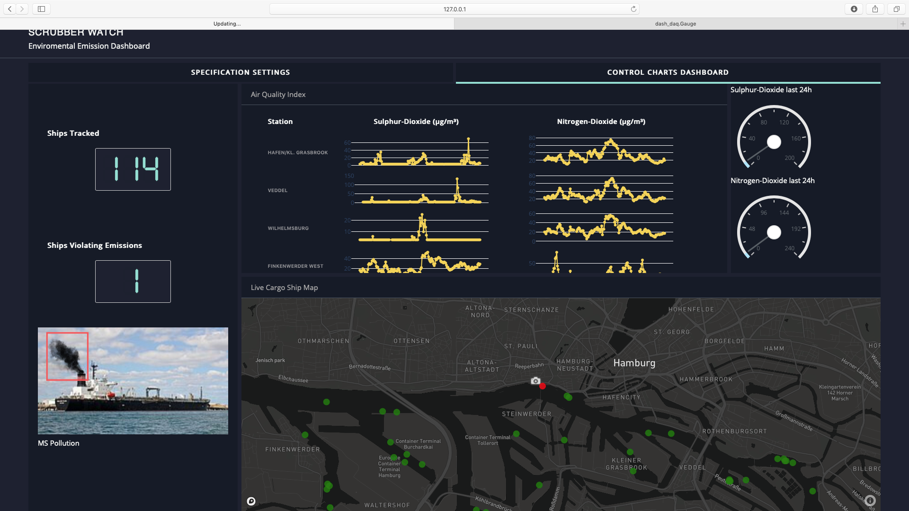

# ScrubberWatch

The idea behind ScrubberWatch is to detect the level of emissions of incoming ships in the Hamburg Harbour using Computer Vision. Essentially, we try to classify whether the [Scrubber](http://www.hfw.com/IMO-2020-Scrubbers-A-good-investment) is turned on based on the smoke the ships are emitting. For detailed information on the use-case, please refer to the [One-Pager](docs/one_pager.pdf) and the [small technical report](docs/technical_report.pdf).

ScrubberWatch is the winning project of the [EIT Digital DeepHack Hamburg](https://ultrahack.org/hamburghack2019). We thank all the mentors, the organizers and especially [Carsten Bullemer](https://seadevcon.com/about-us/) for the valuable discussions, ideas and feedback. 

## Docs and Links

* [Pitch slides](docs/pitch.pdf)
* [One-Pager](docs/one_pager.pdf)
* [small technical report](docs/technical_report.pdf)


## Scrubber Watch - Dashboard

The Dashboard is implemented in [dash](https://plot.ly/dash/). To execute it, install the environment specified in the `dashboard/requirements.txt` via `pip install -r requirements.txt`. Then run `python app.py` within the `dashboard` directory. 




Beware: the code for the dashboard is hackathon-quality!


## Analyzing Scrubber usage by detecting smoke on ships

* all relevant files are in subfolder `smoke_detection`

### Installation

1. Download the [dataset from kaggle](https://www.kaggle.com/arpitjain007/game-of-deep-learning-ship-datasets/) and unpack it into `smoke_detection`. 
You should now have the following folder structure:
    ```bash
    ---smoke_detection/train/images/*.png
    ```

2. unzip the additional smoke data `ship_smokes_fume_pollution.zip` and link it to the train folder
    ```bash
    cd smoke_detection
    unzip ship_smokes_fume_pollution.zip
    mv ship_smokes_fume_pollution train/images
    ```

2. copy `train_smoke.csv` to `train` folder
    ```bash
    cp train_smoke.csv train
    ```

3. setup environment
    ```bash
    conda create --name scrubberwatch python=3.7
    pip install -r requirements.txt
    ```

4. train the recognition model
    ```bash
    python smoke_classification.py
    ```

5. run inference on input image
    ```bash
    python predict_smoke.py image.jpg
    ```

6. evaluation on validation set
    ```bash
    python smoke_validation.py
    ```

### Results

* please refer to the [small technical report](docs/technical_report.pdf).


### Ship Labelling Tool

* The ship labelling tool is a simple `jupyter notebook` with `ipywidgets`. It can be launched with
```bash
cd smoke_detection
jupyter-lab
# open ship_labeling_tool.ipynb
```


# Authors

* Maximillian Franz
* Sandro Braun
* Leander Kurscheidt

# Acknowledgments

* Carsten Bullemer - Thank you for valuable advice towards this project idea.